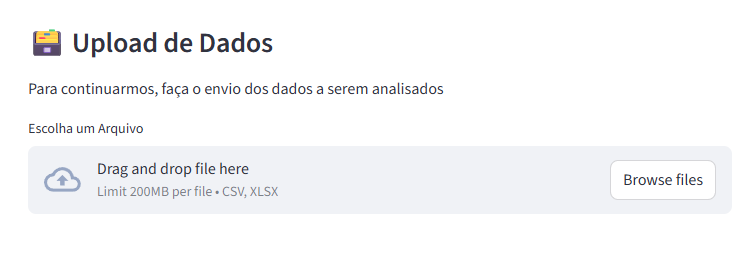
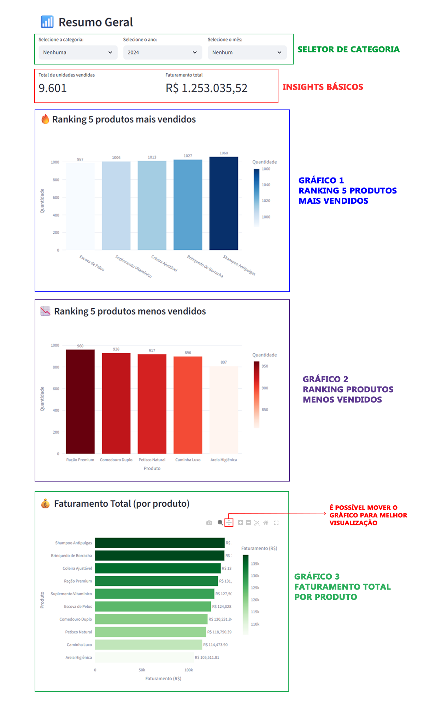
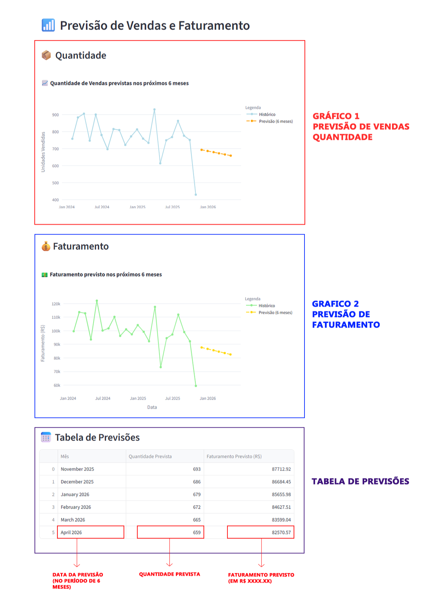

# 🐕 Pet Insights
### O Sistema de Análise de Vendas para Pet Shops

## 📝 Sobre o Projeto:
- O Pet Insights é uma ferramenta para auxiliar Pet Shops em suas tomadas de decisões, utilizando dados históricos de vendas .
- Este projeto consiste em um dashboard interativo desenvolvido com Streamlit, que permite:\
**Analisar a quantidade de vendas e faturamento;\
➡️Visualizar os produtos mais e menos vendidos;\
➡️Filtrar por categoria, ano e mês;\
➡️Exibir gráficos de tendências de vendas e faturamento (via Plotly);\
➡️Realizar uma previsão de vendas e faturamento para os próximos 6 meses, utilizando Scikit-Learn.**

## 🖥️ Tecnologias
- As tecnologias e ferramentas utilizadas nesse projeto são:\
➡️**Linguagem de Programação:** *Python*\
➡️**Framework:** *Streamlit*\
➡️**Bibliotecas de Ciência de Dados/AI:** *Scikt-Learn (machine learning), Plotly (criação e visualização de gráficos), Pandas e NumPy (manipulação e análise de dados)*\
➡️**Controle de Versão:** *GitHub*

## ⬇️ Instalação
- É possível executar a ferramenta pelo **navegador web** (através do link https://petinsights.streamlit.app/), ou localmente.
- Caso seja localmente, siga os passos a seguir para instalar e utilizar a ferramenta: 
  
 I. **Clone o repositório** 
```
git clone https://github.com/eduu038-dev/Pet-Insights
cd Pet-Insights
```
  II. **Instale as dependências**
 ```
pip install -r requirements.txt
```
  III. **Execute o Streamlit**
```
streamlit run main.py
```
  IV. **O app Streamlit iniciará no navegador, geralmente em:**
  ```
http://localhost:8501
```
## ✅ Como utilizar a ferramenta

### 1️⃣ Importando os Dados
- O primeiro passo é realizar a importação da base de dados necessária para a análise. Neste caso, os formatos aceitos são **XLSX (Excel)** e **CSV**.
  


**⚠️ Atenção:** *para que a ferramenta funcione, a base de dados deve estar organizada da seguinte maneira:*


### 2️⃣ Resumo Geral e Filtros
- Nesta seção, é possível visualizar algumas informações básicas, como as **Vendas Totais** e o **Faturamento Total**, além dos **Itens Mais Vendidos**, **Itens Menos Vendidos** e **Faturamento por Produto.**
- É possível filtrar as informações por **Categoria, Mês** e **Ano**.
  


### 3️⃣ Previsão Futura
- Nesta seção, é possível visualizar a previsão da **Quandidade de Vendas** e **Faturamento** para os próximos 6 meses.
- É possível observar através de **Gráficos** e **Tabela**


